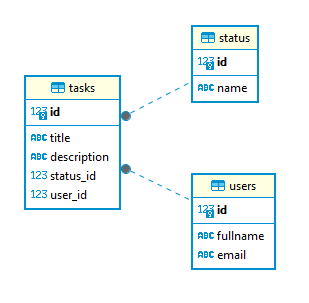

# GoITNeo CS HW-03

## Task 1

Create a database for a task management system using PostgreSQL. The database should include tables for users, task statuses and tasks itself. Perform necessary queries in the task management system database.

### Instructions

1. Create tables in your PostgreSQL database according to the requirements. Use appropriate data types and constraints.

    **Requirements for database structure:**

    **Table `users`:**

     * `id`: Primary key, autoincrement (type `SERIAL`),
     * `fullname`: User's full name (type `VARCHAR(100)`),
     * `email`: User's email address, which should be unique (type `VARCHAR(100)`).

    **Table status:**

     * `id`: Primary key, autoincrement (type `SERIAL`),
     * `name`: Status name (type `VARCHAR(50)`), should be unique. We suggest the following types ```[('new',), ('in progress',), ('completed',)]```.

    **Table tasks:**

     * `id`: Primary key, autoincrement (type `SERIAL`),
     * `title`: Task title (type `VARCHAR(100)`),
     * `description`: Task description (type `TEXT`),
     * `status_id`: Foreign key, that points to id in table status (type `INTEGER`),
     * `user_id`: Foreign key, that points to id in table users (type `INTEGER`).

<div style="text-align:center">



</div>

2. Make sure fields `email` in table `users` and `name` in table `status` are unique.

3. Set up relations between tables in such a way that when user is deleted, automatically all his tasks are deleted (cascading delete).

4. Write a script that creates these tables.

5. Write a script seed.py on Python, which will fill these tables with random values. Use library Faker.

6. Using SQL, execute the following queries in task management system database.

### Queries to execute:
 - **Get all tasks of a specific user.** Use `SELECT` to retrieve tasks by `user_id`.
 - **Get tasks with a specific status.** Use a subquery to select tasks with a specific status, for example, `'new'`.
 - **Update the status of a specific task.** Change the status of a specific task to `'in progress'` or another status.
 - **Get a list of users who have no tasks at all.** Use a combination of `SELECT`, `WHERE NOT IN` and a subquery to get a list of users without tasks.
 - **Add a new task for a specific user.** Use `INSERT` to add a new task.
 - **Get all tasks that are not yet completed.** Select tasks where the status is not `'completed'`.
 - **Delete a specific task.** Use `DELETE` to delete a task by its `id`.
 - **Find users with a specific email.** Use `SELECT` with a `LIKE` condition to filter users by email.
 - **Update a user's name.** Change a user's name using `UPDATE`.
 - **Get the number of tasks for each status.** Use `SELECT`, `COUNT`, `GROUP BY` to group tasks by statuses.
 - **Get tasks assigned to users with a specific email domain.** Use `SELECT` with a `LIKE` condition in combination with `JOIN` to select tasks assigned to users whose email contains a specific domain (for example, `'%@example.com'`).
 - **Get a list of tasks without a description.** Select tasks where the description is missing.
 - **Get users and their tasks**. Use `INNER JOIN` to get a list of users and their tasks with a specific status.
 - **Get users and the number of their tasks.** Use `LEFT JOIN` and `GROUP BY` to get a list of users and the number of their tasks.

### Solution

- Script to create a database and tables: `./Task1_CreateDB.sql`.
- Script to seed the database: `./seed.py`.
- Script to execute queries: `./Task1_Queries.sql`.

## Task 2

